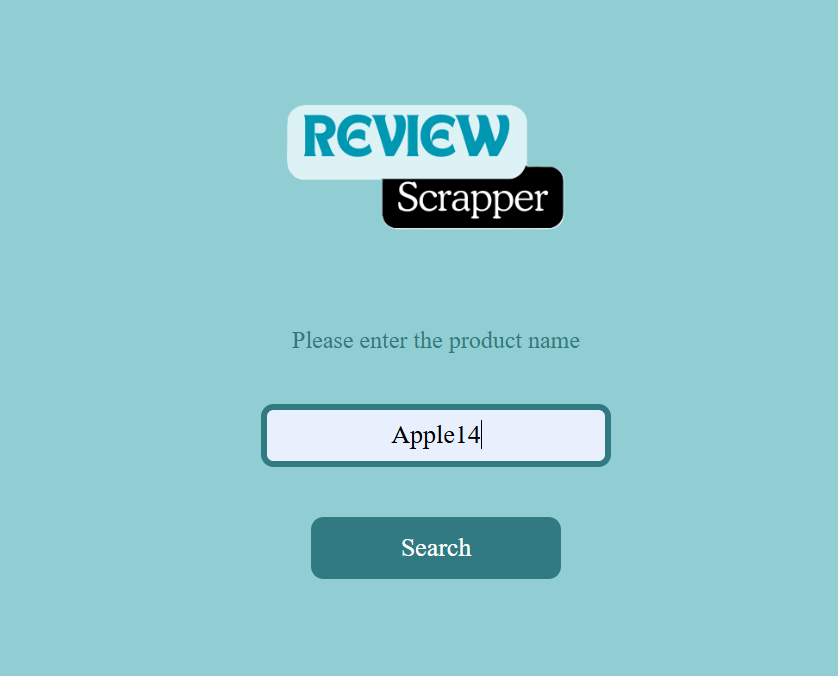
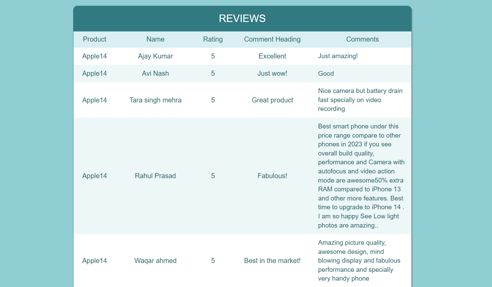

# Flipkart Product Review Scraper

This project is a web scraper built to extract product reviews from Flipkart and store them in a CSV file. The scraper collects review data such as reviewer name, rating, HeadingComment, and Comment for each product, and saves it in a structured CSV file for further analysis.

## Features

- Scrapes product reviews (name, rating, review text, Comment) from Flipkart.
- Stores the scraped review data in a CSV file.

## Technologies Used

- **Python 3.x**: Programming language used.
- **BeautifulSoup**: For parsing HTML and extracting data.
- **Requests**: To send HTTP requests and retrieve HTML content.

## Prerequisites

Before running the project, ensure you have the following Python libraries installed:

- `beautifulsoup4`
- `requests`
- `flask`

You can install these dependencies using:

```bash
pip install beautifulsoup4 requests flask
```

## Setup

1. Clone the Repository
```bash
git clone https://github.com/Sankrita05/ReviewScraper
```
```bash
cd ReviewScraper
```

2. Download required Dependencies
```bash
pip install -r requirements.txt
```
3. Run the scraper 
To start scraping product reviews, execute the app.py script:

```bash
python app.py
```
4. Enter the Product Name in Input Box. 


5. The Output will be shown as:

